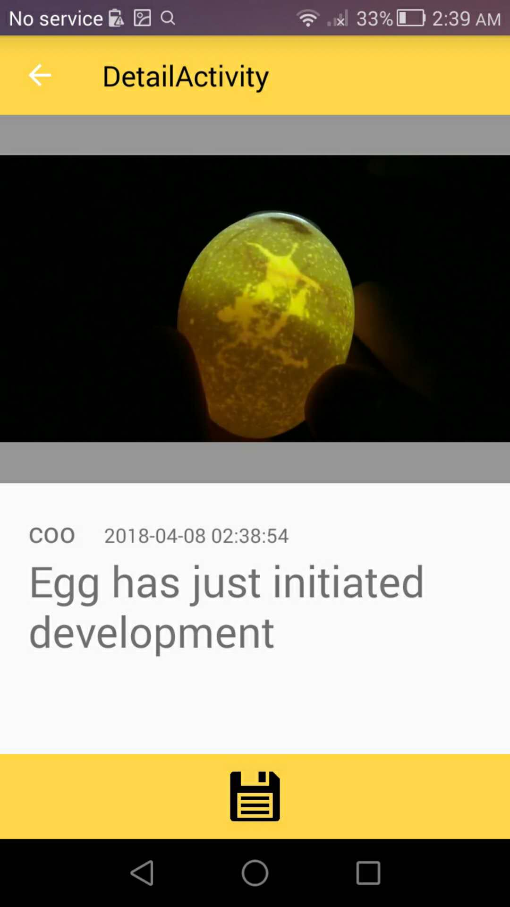
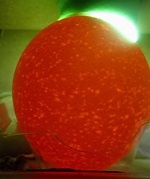

# Hachy-android
Hachy uses machine learning to candle eggs with a <b>phone</b> and a <b>Hachy Box</b>:
![screenshot][userImage]

## Table of Content
This document is also avaliable in
* [Concept](#concept)
	* [Audience](#audience)
	* [Vision](#vision)
	* [Mission](#mission)
	* [Business Model](#business-modal)	
	* [Competition](#competition)
* [Getting Started](#get-started)
	* [Hachy Box Setup](#hachy-box-setup)
	* [Install Android App](#install-android-app)
	* [Android App Demo](#android-app-demo)
	* [Facebook Test User Account](#facebook-test-user-account)
	* [Web Client Demo](#web-client-demo)
* [Architecture](#architecture)
	* [How it Works](#how-it-works)
	* [Azure Usage](#azure-usage)
	* [Egg Development Data Selection](#egg-development-data-selection)
* [Author and License](#author-and-license)

## Concept
With the rise of machine learning and image recognition technologies, the market has seen useful agricultural tools such as [Banana Freshness Analyzer][bananaAnalyize], a [Cucumber Sorter][cucumberSorter], and so on. However, there lacks a tool for egg farmers and consumers for **smart egg checking**. 

### Audience
In fact, 400 billion eggs are produced in China and 100 billion in USA annually. On average, each farmer spends 243 minutes weekly to care for their eggs. Of these times, 1/10 to 1/4 of the time is spent checking the status of the egg's development. Some farmers check as little as 2 times, others check as often as daily until the egg hatches. From our experiment, we found that an egg would take 40 seconds for candling whereas Hachy reduces the time to 5 seconds. 

**[Cath]** lives in rural Italy and raises 23 hens. When she got started, she had to invest weeks of learning before becoming an expert at checking egg development status. Using Hachy, Cath will get the status of her eggs by simply scanning eggs in the Hachy Box so that she would not need to fetch eggs, candle, and analyze development manually.

On the demand side of the market, many shoppers at farmers' market who routinely shop for fresh organic eggs often find it a hassle to pick eggs and candle them one by one. **[Wancai]** lives in PingTung, Taiwan. He is a organic egg shoper at PingTung’s local farmers' market. He has been selecting his eggs for the best quality breakfast every morning. Hachy will help him get the best quality eggs in the shortest time when shopping for eggs.

### Vision
The vision of our team is building an autonomous egg incubating tool that allows no human involvement in the incubating, candling and hatching of eggs. Hachy is considered as the first stage that enables autonomous egg development identification and tracking. 

### Mission
Therefore, Hachy aims to:
•	Reduce the skills requirement(s) for consumers egg shopping by providing a easy way to identify the development status of the egg
•	Reduce the time for homestead farmers who raise egg themselves
By: 
•	Using Image Recognition Service provided by Azure to determine the development of an egg
•	Using Web & Mobile services to store data on the cloud such that the egg stats are readily avaliable whenever the user needs them

### Business Model
The eventual business model will be a consumer-oriented subscription program. It will require the user to pay a small subscription fee: predetermined to be $50 annually or $10 monthly where the first 2 weeks will be offered as a free trial.
However, a more imminent approach would be modeling it as a research tool and provide it to universities. In fact, we have received guidance from South China Agricultural University and a few students from Xinjiang Agricultural University working with us on this project. As of writing this project proposal I am seeking cooperation from faculty members and students at the University of Toronto. 

### Competition
Currently, there are a variety of egg candling lamps in the market ranging from $10 to $50: from an affordable one such as Magicfly Bright Cool LED Light Egg Candler Tester - Incubator Warehouse Exclusive ($18) to a higher-end one such as Egg Or-Candle. 

However, our project is fundamentally different from those in that it uses machine learning to generate the egg candled result rather than requiring a human to identify the result. It eliminates the last human factor in the chain. In addition, since Hachy stores egg information on the cloud, egg development stats can be integrated with farmers’ existing digital systems to enable an autonomous egg caring farm.

## Getting Started
### Hachy Box Setup
	
1. Purchase or make a cardbox with the following specifications: 
![boxdesign][bpxSetup]
Finished setup looks like this: 
![screenshot][banner]

### Install Android App
#### Option 1: Clone and build this repo
1. `$git clone https://github.com/hachyEgg/hachy-android`
2. Open Android Studio -> Open -> (select this root folder)
3. Click Run on the menu bar
4. Select to whether run on a connected device or emulator

#### Option 2: Download and install the APK from [GooglePlay](https://play.google.com/store/apps/details?id=ms.imagine.foodiemate)

#### Option 3: Download and install the APK from [Hachy Web](https://hachy.azurewebsites.net)

#### Requirements:
 * Android Studio 3.0.0
 * Android 4.4 KitKat, API Level 19
 * 1GB of allocated ram
 * Please ensure that you grant camera and external storage permission when asked

### Android App Demo

### Facebook Test User Account
item | value
:------:|:----------:
email   | scqerjhwwi_1523431167@tfbnw.net
password| hachEgg 

### Procedure
1. Insert the device into the cardboard box. A completed set up would look like this:
![screenshot][img-beforeinsert]

2. Insert egg, close egg, and turn on the light source. Observe that the phone screen will show the egg:
![screenshot][img-afterinsert]

3. Open the app, login, and choose either to take a picture or import an existing egg picture: 

 Sign in                   |  Egg Catalogue                 |       Select Picture            |    Take Picture   
:-------------------------:|:------------------------------:|:-------------------------------:|:---------------------------:
 |  |   |  
 
4. Press the button to capture the egg. The image will be persisted on the cloud and sent to Azure for analysis. Upon completion, the status of the egg will change from "egg not found" to the determined result.

Determining Egg in Progress:|  Egg development initiated    |   Found Egg but No development  |    No Egg found
:-------------------------:|:------------------------------:|:-------------------------------:|:---------------------------:
|| | 

5. Navigate back to observe a catalogue of egg statuses.

### Web Client Demo
As the phone is being mounted onto the cardboard box, it is a little hard to track the egg status on the phone screen. The [Hachy Web Client](https://github.com/hachyEgg/hachy-web-dist) lets you see analysis data in realtime, synced with the device remotely. 

## Architecture
![screenshot][img-architecture]

### How it Works
Hachy contains 6 components: Hachy Box, App, Web Client, Server, Database, and CustomVision.ai

|  Component   |   function	|building block|
|------------:|:--------------------------------|:------------|
|**Hachy Box**  |Hosts the egg and mount the phone.  | Cardboard box|
|**Android App**|Takes pictures of the egg and uploads them as request display a catalogue of eggs retrieved. | Kotlin, Android |
|**Web Client** |Displays egg status on the web.|Angular2, github continous integration|
|**Server**     |Receives the request from the app/web client and processes the request. Sends to Azure image for analysis or pull catalogue, then returns the data to the app/web client.|NodeJs|
|**Database**   |Stores logs and photos, uses rest contracts to establish a database connection.| Firebase, REST API|
|**CustomVision.ai**|The core engine of the app which is trained using images of different stages of egg development and produces analysis results. | Azure Custom Vision |

### Azure Usage
The technology used here is Azure Web/Mobile Service and Custom Vision. Web/Mobile Service is used to host an angular/node app which hosts the web client that displays the egg catalogue and handles requests being sent from the mobile. The Custom Vision service is used to train image recognition logistics with given datasets on egg development in 3 stages: early, middle, and mature.

### Egg Development Data Selection
The datasets of which this model is trained is labeled using 3 different tags: 
 * egg_0 for egg with no development (no development)
 * egg_1 for egg with a visible zygote (developing)
 * egg_2 for egg with visible blood lines and other organs (mature)
 
Of all these tags, the training image of eggs will have black/dark background and a yellowish light sphere, such that the training photo bear close resemblance to that of an egg in the Hachy Box. Here are some examples:

 eggEarly                  |  eggMid                      |       eggLat                   
:-------------------------:|:----------------------------:|:--------------------------:
 |  |  

After 3 iterations, the precision of the 3 tags has yielded Ok level of precision and recalls: 

However, there are exceptions to this data recognition as well. For example, pointing it to any other spherical object with a background of a significantly different hue mistakes the object for an egg and produces funny results.

## AUTHOR and LICENSE
Copyright (c) 2016 Eugene Wang [The MIT License (MIT)](LICENSE)

[comment]: # (Reference of images and links)
[userImage]:screenshots/banner.png
[bananaAnalyize]: https://www.ncbi.nlm.nih.gov/pubmed/25745200
[cucumberSorter]: https://persol-tech-s.co.jp/i-engineer/product/cucumber
[usaeggproduction]: https://www.statista.com/statistics/196096/total-egg-production-in-the-us-since-2000/
[Cath]: https://www.youtube.com/channel/UCCGhip1gdKPcq0g1rTKBlwQ
[Wancai]: https://www.youtube.com/watch?v=-wZeUUgJdUM
[img-architecture]: screenshots/img-architecture.png
[bpxSetup]: screenshots/boxsetup.png
[vid-appdemo]: screenshots/hachydemo.jpg
[img-beforeinsert]: screenshots/beforeInsert.png
[img-afterinsert]: screenshots/afterInsert.png
[vid-hahcy]: https://www.youtube.com/watch?v=y0aG22pkg6I
