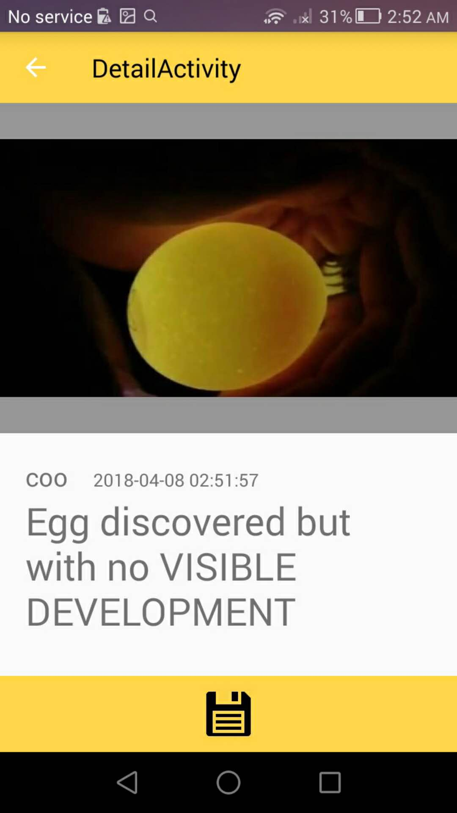

# Hachy-android
Hahcy uses machine learning to candle eggs with a <b>phone</b> and a <b>Hachy Box</b>:
![screenshot][userImage]

## Table of Content
* [Concept](#concept)
	* [Audience](#audience)
	* [Vision](#vision)
	* [Mission](#mission)
	* [Business Modal](#business-modal)	
	* [Competition](#competition)
* [Get Started](#get-started)
	* [Hachy Box Setup](#hachy-box-setup)
	* [Install Android App](#install-android-app)
	* [Android App Demo](#android-app-demo)
	* [Web Client Demo](#web-client-demo)
* [Architecture](#architecture)
	* [How it works](#how-it-works)
	* [Azure Usage](#azure-usage)
	* [Egg Development Data selection](#egg-development-data-selection)
* [References](#References)
	* [Libraries](#libraries)
	* [Dependencies](#dependencies)
	* [Author and License](#author-and-license)

## Concept
With the rise of Machine Learning and Image Recognition technologies, the market has seen useful agricultural tools such as [Banna Freshness Analyzer][bananaAnalyize], a [Cucumber Sorter][cucumberSorter] and so on. However, there lacks a tool for egg farmers and consumers for **smart egg checking**. 

### Audience
In fact, 400 billion eggs being produced in China and 100 billion in USA annually. On average each farmer spend 243 minues weekly to care for the eggs, and of these time 1/10 to 1/4 of the time are spent on checking the status of the egg development depending on how often they check. Some farmers check as little as 2 times, other check as often as daily until egg hatches. From our experiment we found that an egg would take 40 seconds for candling whereas Hachy reduces the time to 5s. 

**[Cath]** lives in rural Italy and raised 23 hens when she got started, she had to invest weeks of learning before becoming an expert at checking egg development status. Using Hachy, Cath will get status of her eggs by simply scanning eggs in the Hachy Box, so that she would not need to manually fetch eggs, candle and analyze development mannually.

On the demand side of the market, many shoppers at farmers' market who routinely shop for fresh organic eggs often find it a hassle to pick eggs and candle them one by one. **[Wancai]** lives in PingTung, Taiwan. He is a organic egg shoper at PingTung’s local farmers market. He has been selecting his eggs for the best quality for breakfast every morning. Hachy will help him get the best quality eggs in the shortest time when he shops for eggs.

### Vision
The vision of our team is building an autonomous egg incubating tool that allows no human involvement in the incubating, candling and hatching of eggs. Hachy is considered as the first stage that enables autonomous egg development identification and tracking. 

### Mission
Therefore, Hachy aims to:
•	reduce the skills requirement for consumers to shop egg by providing a easy way to identify the development status of the egg.
•	Reduce the time for homestead farmers who raise egg themselves. 
By: 
•	Use Image Recognition Service provided by Azure to determine the development of an egg
•	Use Web & Mobile service to store data on the cloud such that the egg stats is readily avaliable whenever the user need them.

### Business Modal
The eventual business modal will be a consumer oriented subscription program:, it will require the user to pay a small amount of fee: predetermined to be 50$ annually or 10$ monthly the first 2 weeks will be offered as free trial.
However, a more imminent approach would be modeling it as a research tool and provide it to universities: in fact, I have a few students from Xinjiang Agricultural university working with me on this project and received the guidance from South China Agricultural university. So, a second option is providing it as a research tool to universities, as of writing this project proposal I am seeking cooperation from faculty members and students at the University of Toronto. 

### Competition
Currently, there are a variety of egg candling lamp in the market ranging from 10 dollars to 50 for a cheap one such as Magicfly Bright Cool LED Light Egg Candler Tester - Incubator Warehouse Exclusive which cost 18$ or even more fancy ones such as Egg Or-Candle which would cost much more. 

However, this project is fundamentally different from those in that it uses machine learning to generate the egg candled result rather than still requiring a human to identify the result. It eliminate the last human factor in the chain. In addition, since Hachy stores egg information on the cloud, the egg development stats can be integrated with existing farmers’ digital system to enable autonomous egg caring farm.

## Get Started
### Hachy Box Setup
	
1. Purchase or make a cardbox of the following specs: 
![boxdesign][bpxSetup]
Finished setup looks like this: 
![screenshot][banner]

### Install Android App
#### Option 1: Clone this repo and build it yourself
1. `$git clone https://github.com/hachyEgg/hachy-android`
2. Open Android Studio->Open->(select this root folder)
3. Click run on the menubar
4. select to whether run on a connected device or emulator

#### Option 2: Download and install apk from [GooglePlay](https://play.google.com/store/apps/details?id=ms.imagine.foodiemate)

#### Option 3: Download and install apk from [Hachy Web](https://hachy.azurewebsites.net)

#### Requirement:
 * Android Studio 3.0.0
 * Android 4.4 KitKat, API Level 19
 * 1G of allowcated ram
 * Please ensure you grant the camera and external storage permission when asked

### Android App Demo

### Procedure
1. insert the device into the cardbox, A completed set up would look like this:
![screenshot][img-beforeinsert]

2. insert egg, close egg and turn on the light source, observe that the phone screen will show a the egg:
![screenshot][img-afterinsert]

3. open app, login, and choose either to take picture or import existing egg picture: 

 Sign in                   |  Egg Catalogue                 |       Select Picture            |    Take Picture   
:-------------------------:|:------------------------------:|:-------------------------------:|:---------------------------:
 |  |   |  
 
4. Press the button to capture the egg, the image will be persisted on the cloud and sent to Azure for analysis, Upon result complete, the status of the egg will change from "egg not found" to the deteremiend result

Determining Egg in Progress:|  Egg development initiated    |   Found Egg but No development  |    No Engg found
:-------------------------:|:------------------------------:|:-------------------------------:|:---------------------------:
|| | 

5. Navigate back to observe a catalogue of egg status

### Web Client Demo
As the phone is being mounted on the cardboard, it is a little hard to track egg status, the [Hachy Web Client](https://github.com/hachyEgg/hachy-web-dist) lets you see analysis data in realtime sync with the device remotely. As the phone maybe a little hard to check as it is been mounted.

## Architecture
![screenshot][img-architecture]

### How it Works
As you have learned previously, Hachy is composed of 6 parts: Hachy Box, App, WebClient, Server, Database, and CustomVision.ai

|  Component   |   function	|building block|
|------------:|:--------------------------------|:------------|
|**Hachy Box**  |host the egg and mount the Phone  | Cardbox|
|**Android App**|takes pictures of egg and upload picture as request display a catalogue of eggs retrieved | Kotlin, Android |
|**Web Client** |display egg status on web|Angular2, github continous integration|
|**Server**     |recieves the request from app/web client process request: send to azure image for analysis or pull catalogue, then return the data to the app/web client.|NodeJs|
|**Database**   |store logs and photos, cuse rest contracts to establish databse connection| Firebase, RestApi|
|**CustomVision.ai**|the core engine of the app trained using images of different stages of egg development and produce analysis result | Azure CustomVision |

### Azure Usage
The technology used here are Azure Web/Mobile Service and Custom Vision. Web/mobile service is used to host an angular/node app which host the web client that display egg catalogue, and handle request being sent from the mobile. The custom view service is used to train image recognition logistics with given datasets on egg development on 3 stages: early, middle, mature.

### Egg Development Data Selection
The datasets of which this modal is trained labeled in 3 different tags: 
 * egg_0 for egg with no development (no development)
 * egg_1 for egg with a visible zygote (developing)
 * egg_2 for egg with visible blood lines and other organs (mature)

## AUTHOR and LICENSE
Copyright (c) 2016 Eugene Wang [The MIT License (MIT)](LICENSE)

[comment]: # (Reference of images and links)
[userImage]:screenshots/banner.png
[bananaAnalyize]: https://www.ncbi.nlm.nih.gov/pubmed/25745200
[cucumberSorter]: https://persol-tech-s.co.jp/i-engineer/product/cucumber
[usaeggproduction]: https://www.statista.com/statistics/196096/total-egg-production-in-the-us-since-2000/
[Cath]: https://www.youtube.com/channel/UCCGhip1gdKPcq0g1rTKBlwQ
[Wancai]: https://www.youtube.com/watch?v=-wZeUUgJdUM
[img-architecture]: screenshots/img-architecture.png
[bpxSetup]: screenshots/boxsetup.png
[vid-appdemo]: screenshots/hachydemo.jpg
[img-beforeinsert]: screenshots/beforeInsert.png
[img-afterinsert]: screenshots/afterInsert.png
[vid-hahcy]: https://www.youtube.com/watch?v=y0aG22pkg6I